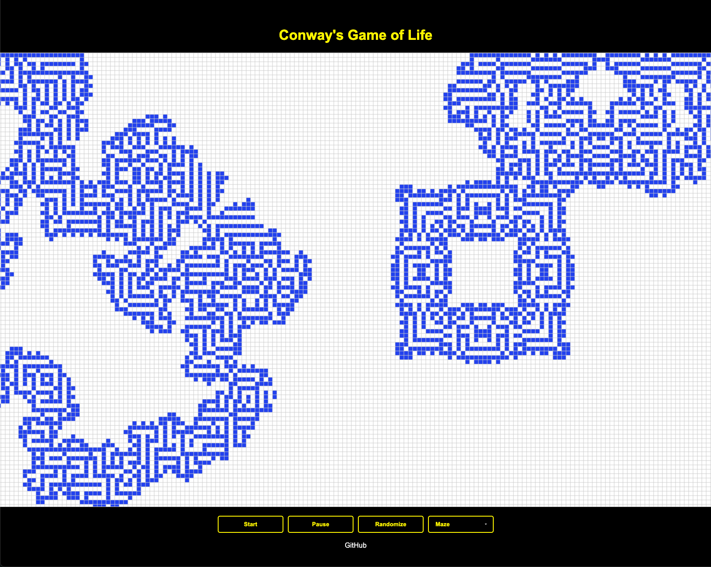

# Conway's Game of Life



This repository is an implementation of **Conway's Game of Life**, a classic cellular automaton devised by mathematician John Conway. The project is built using HTML, CSS, and JavaScript, and demonstrates various software design patterns for maintainability and scalability.

**[Live Demo](https://elarsaks.github.io/Game-Of-Life/)**

## Table of Contents
- [Overview](#overview)
- [Features](#features)
- [Design Patterns Used](#design-patterns-used)
- [Project Structure](#project-structure)
- [Installation](#installation)
- [Usage](#usage)
- [Strategies Available](#strategies-available)
- [Contributing](#contributing)
- [License](#license)

## Overview
Conway’s Game of Life is a zero-player game where an initial set of cells evolve over discrete time steps according to a set of rules. Each cell’s state (alive or dead) in the next generation depends on the number of live neighbors it currently has. Through these simple rules, complex and beautiful patterns can emerge.

**Conway's Basic Rules (Classic Conway):**
1. Any live cell with two or three live neighbors survives.
2. Any dead cell with three live neighbors becomes alive.
3. Otherwise, all other live cells die in the next generation and all dead cells remain dead.

## Features
- **Interactive Grid Rendering:** Utilize a canvas to visualize and interact with the evolving cellular grid.
- **Start/Pause Control:** Easily control simulation flow.
- **Randomize Board:** Quickly seed the board with a random configuration.
- **Multiple Rule Sets (Strategies):** Switch between different life-like automata rules.
- **Responsive Design:** The canvas and controls adapt to various screen sizes.

## Design Patterns Used
This project serves as a learning example of several key design patterns:

- **Singleton:**  
  Ensures there is only one instance of certain core classes (e.g., `Game.js` manages a single global game instance).

- **Factory:**  
  Used in `CellFactory.js` to create different types of cells (alive/dead) without exposing the creation logic to the client code.

- **Builder:**  
  Implemented in `BoardBuilder.js` to construct complex `Board` objects step-by-step, allowing flexible customization (e.g., different sizes, initial conditions).

- **Adapter:**  
  The `CanvasAdapter.js` acts as an adapter that abstracts away the details of drawing on the HTML canvas, allowing for a cleaner and more testable interface.

- **Strategy:**  
  `Strategy.js` implements different rulesets (e.g., Classic Conway, High Life, Seeds) as interchangeable strategies without changing the core simulation code.

- **Observer:**  
  The `Observer.js` pattern allows the game state (subject) to notify observers (e.g., UI updates, logging) about state changes without tightly coupling them.

- **State:**  
  `Cell.js` uses a State pattern to handle the cell’s alive/dead conditions and transitions, making state changes more explicit and manageable.

## Project Structure
Below is an outline of the project’s file structure as inferred from `index.html`:

```
.
├─ index.html
├─ style.css
├─ app.js                  // Main application logic (initialization, event listeners)
└─ src/
   ├─ Board.js             // Core simulation logic for the board
   ├─ BoardBuilder.js      // Builder pattern for creating and configuring Board
   ├─ CanvasAdapter.js     // Adapter pattern to abstract canvas operations
   ├─ Cell.js              // Implements the State pattern for cell behavior
   ├─ CellFactory.js       // Factory pattern to create cells
   ├─ Game.js              // Singleton pattern managing the global game instance
   ├─ Observer.js          // Observer pattern implementation
   └─ Strategy.js          // Strategy pattern for different life-like rules
```

## Installation
1. **Clone the repository:**
   ```bash
   git clone https://github.com/elarsaks/Game-Of-Life.git
   ```
2. **Open in Browser:**
   Simply open `index.html` in your web browser. No build steps are needed.

## Usage
1. **Load the page:** Open `index.html` in any modern browser.
2. **Start the Simulation:** Click the **Start** button to begin stepping through generations.
3. **Pause the Simulation:** Click the **Pause** button to halt evolution at the current state.
4. **Randomize the Board:** Click **Randomize** to initialize the board with random cell states.
5. **Change Rules (Strategy):** Use the dropdown to switch between different rule sets like Classic Conway, High Life, Seeds, etc.
6. **Experiment:** Try different initial configurations and strategies to discover interesting patterns!

## Strategies Available
The dropdown in the UI allows you to select from multiple strategies:
- **Classic Conway**
- **Day and Night**
- **Diamoeba**
- **High Life**
- **Life Without Death**
- **Maze**
- **Replicator**
- **Seeds**
- **Two by Two**
- **Vote**

Each of these is an alternative set of rules encapsulated by the Strategy pattern, providing different evolutionary outcomes.

## Contributing
Contributions are welcome! Please:
- Fork this repository
- Create a new branch for your feature or bugfix
- Submit a pull request describing your changes

Ensure all contributions adhere to the coding style and are well-documented.

## License
This project is licensed under the [MIT License](LICENSE). You’re free to use, modify, and distribute this code as permitted by the license.

---

**Explore, learn, and have fun with Conway’s Game of Life!**
